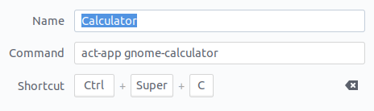

# App activator

A simple bash script to run/activate/minimize any app:

- If an app is not started -- launch it
- If an app already running -- activate it
- If an app is running and active -- minimize it

## Install

Install needed tools

```bash
sudo apt install xdotools wmctrl 
```

Copy `act-app.sh` in any reachable directory (e.g. `/usr/local/bin`).

## Usage example

Use:

```bash
act-app.sh {application-name}
```

In Ubuntu:

Go `Settings > Keyboard Shortcuts`, and add a custom shortcut (e.g. to start gnome calculator):



After this everything should work automatically, and you'll be able to start/activate/minimize the calculator with this
shortcut. 
